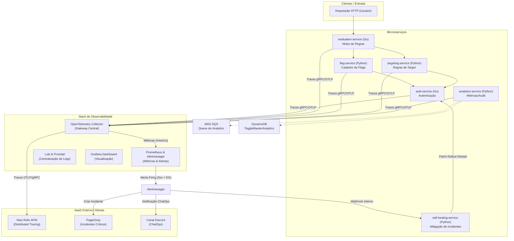

# 🌐 Contexto do Projeto ToggleMaster — Fase 4

Este documento reúne o contexto técnico, arquitetura e fluxo operacional do ecossistema **ToggleMaster**, desenvolvido para a Fase 4 do Tech Challenge (POSTECH - FIAP). O objetivo principal desta fase é garantir **Observabilidade Total**, **Tracing Distribuído** e **Self-Healing (Autorrecuperação)** no ambiente Kubernetes (EKS) via GitOps (ArgoCD) de forma 100% automatizada.

---

## 🏗️ Arquitetura do Sistema e Fluxo de Telemetria

O ecossistema ToggleMaster é composto por 5 microsserviços principais de negócio, 1 microsserviço de autorrecuperação (Self-Healing) e uma stack completa de observabilidade operando no cluster.



---

## 📦 Componentes do Ecossistema

### 1. Microsserviços de Negócio (`services/`)
* **`auth` (Go):** Responsável por autenticar usuários e emitir tokens JWT. Instrumentado com `otlptracegrpc` e middleware `otelhttp.NewHandler`.
* **`evaluation` (Go):** O motor de avaliação que decide quais flags estão ativas para cada usuário. Instrumentado com `otelhttp.NewTransport` para propagar cabeçalhos W3C Trace Context (Tracing Distribuído) nas requisições downstream para `flag` e `targeting`.
* **`flag` (Python/FastAPI):** Gerencia o cadastro e estados das feature flags. Instrumentado com `FlaskInstrumentor` e `RequestsInstrumentor`.
* **`targeting` (Python/FastAPI):** Define regras de segmentação de usuários. Instrumentado com SDK OpenTelemetry para Python.
* **`analytics` (Python/FastAPI):** Coleta métricas de uso de flags de forma assíncrona usando filas SQS e gravando os resultados no DynamoDB.

### 2. Infraestrutura e Banco de Dados (`terraform/`)
A infraestrutura é provisionada como Código (IaC) via **Terraform** na nuvem AWS, compatível com a conta de estudante **AWS Academy** (utilizando `LabRole`):
* **Cluster EKS:** Kubernetes gerenciado no EKS com node groups auto-escaláveis.
* **Banco de Dados (RDS PostgreSQL):** 3 instâncias separadas para isolamento dos dados dos microsserviços.
* **Cache (ElastiCache Redis):** Armazena chaves temporárias para alta performance de leitura de flags.
* **Banco NoSQL (DynamoDB):** Tabela `ToggleMasterAnalytics` para consolidar auditorias.
* **Mensageria (SQS):** Fila assíncrona de ingestão do analytics.
* **ECR (Elastic Container Registry):** 6 repositórios privados para hospedar as imagens Docker dos microsserviços.
* **ArgoCD:** Instalado via Helm Provider no Terraform para gerenciar a entrega contínua.

### 3. Stack de Observabilidade (`gitops/apps/monitoring/`)
* **OpenTelemetry Collector:** Gateway centralizador. Recebe os dados brutos de tracing via gRPC e HTTP das aplicações, reduzindo overhead de rede ao comprimir e encaminhar em lote para o New Relic APM. Também expõe métricas para coleta do Prometheus.
* **Prometheus + Grafana (`kube-prometheus-stack`):** Coleta métricas do cluster, sistema operacional e do OTel Collector. Apresenta painéis em um dashboard Grafana customizado (CPU, Memória, QPS, Latência e Logs integrados).
* **Loki + Promtail (`loki-stack`):** Solução de logging leve e de baixo custo. O Promtail roda como DaemonSet coletando logs estruturados do `stdout` de todos os contêineres e enviando-os para indexação no Loki.
* **New Relic APM:** Destino final de traces e mapeamento topológico da rede. Permite inspecionar o tempo gasto em cada microsserviço nas transações ponta a ponta (Distributed Tracing).

### 4. Alertas Inteligentes e Self-Healing (`services/self-healing/`)
* **Regra de Alerta:** Configurada via `PrometheusRule` (`AuthServiceHighErrorRate`). Dispara se a taxa de erros HTTP 5xx no serviço `auth-service` for superior a 5% durante 10 segundos.
* **Roteamento de Alertas:** Quando o alerta entra em estado `firing`, o Alertmanager envia a notificação para 3 destinos concorrentes:
  1. **PagerDuty:** Cria automaticamente um incidente crítico para o time de suporte (Events API v2).
  2. **Discord:** Notifica o canal da equipe de SRE (ChatOps) com as informações do erro.
  3. **Self-Healing Webhook:** Invoca um microsserviço Flask interno no cluster (`self-healing-service`).
* **Ação do Self-Healing:** O serviço roda com privilégios RBAC limitados (`ServiceAccount` customizada com acesso exclusivo a patches de deployments no namespace `togglemaster`). Ele realiza um **Rollout Restart** no deployment afetado aplicando uma anotação de timestamp. O Kubernetes gerencia a reinicialização progressiva dos pods defeituosos de forma transparente, restaurando o serviço automaticamente.
* **Notificação de Resolução:** Uma vez restaurado o serviço, o alerta é desfeito e o Alertmanager envia mensagens de `resolved` para o Discord e o PagerDuty (que fecha o incidente automaticamente).

---

## 🔄 Fluxo de Automação CI/CD (GitFlow)

O projeto elimina completamente os passos manuais através de pipelines inteligentes no GitHub Actions:

```
Push para a branch main
  │
  ├── ⚙️ ci-terraform.yml
  │     ├── Provisiona infraestrutura na AWS (se houver alterações)
  │     ├── Lê credenciais dos GitHub Secrets (New Relic, PagerDuty, Discord)
  │     ├── Injeta em runtime nos manifestos YAML do GitOps (evitando plaintext exposto)
  │     ├── Aplica os Namespaces, ArgoCD Applications, Monitoring e Self-Healing
  │     └── Garante o estado desejado no cluster
  │
  └── 🐳 ci-<serviço>.yml (Gatilhado por mudanças nas pastas dos serviços)
        ├── Executa testes unitários e de integração
        ├── Executa checagens de vulnerabilidade (ex: Bandit para Python)
        ├── Compila a imagem Docker e publica no AWS ECR correspondente
        ├── Atualiza a tag da imagem no repositório GitOps via yq/sed (GitOps Trigger)
        └── ArgoCD detecta a mudança e sincroniza de forma automática e declarativa
```

Para subidas iniciais de laboratório, o workflow **`ci-bootstrap.yml`** (Bootstrap) executa todo o ciclo de ponta a ponta de forma automatizada com um único clique.

---

## 🛠️ Como Validar o Funcionamento

As validações e passos detalhados de deploy do zero estão documentados no arquivo [Passo-a-Passo_exec.md](file:///Users/chavatta/Library/Mobile%20Documents/com~apple~CloudDocs/Challenge_4/Passo-a-Passo_exec.md). O resumo do fluxo é:

1. **Configurar os 8 GitHub Secrets** no repositório (AWS credentials, banco de dados, chaves PagerDuty, Discord e New Relic).
2. **Executar o Workflow de Bootstrap** ou realizar um push para a branch `main`.
3. **Validar visualmente:**
   * Acessar o console do Grafana via IP público do LoadBalancer.
   * Visualizar o **Service Map** e o **Distributed Tracing** no painel do New Relic APM.
   * Gerar erros propositais no `auth-service` para verificar o ciclo de auto-recuperação (Self-Healing), abertura do incidente crítico no PagerDuty e alertas de ChatOps no Discord.
